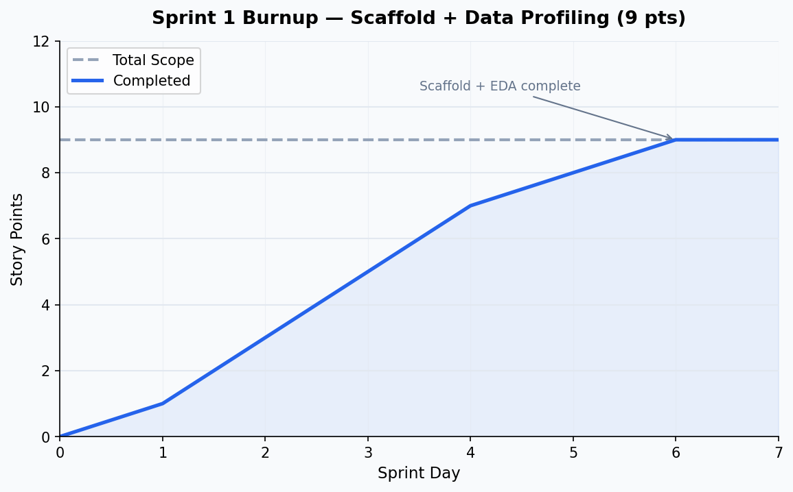

# Sprint 1 Report
**Product:** LENS
**Team:** LENS
**Date:** June 2026

---

## Actions to Stop

No major process issues identified. This was a solo scaffold sprint with one active contributor. The main concern going forward is ensuring all team members are onboarded and contributing from Sprint 2 onward.

---

## Actions to Start

- Establish shared environment setup documentation so teammates can run the project from day one.
- Define sprint goals and card assignments before the sprint starts, not during.
- Begin sharing source data files and DB access across the team early so no one is blocked at the start of the next sprint.

---

## Actions to Keep

- Docker Compose for consistent, reproducible environments across all machines.
- CI from the start — lint + tests on every PR via GitHub Actions.
- Branch protection and PR-based workflow.

---

## Work Completed

| Card | Owner | Pts | Acceptance Criteria | Definition of Done |
|---|---|---|---|---|
| Scaffold: Docker, FastAPI, React/Vite/TS, PostGIS, Leaflet, Alembic, CI, branch protection | Jacob | 3 | App boots with one command; CI runs on every PR | All services up via `docker compose up`; CI green ✅ |
| Exploratory data analysis: SF crime dataset profiling | Jacob | 2 | Understand schema, data quality, and field semantics before building anything | `pipeline/analysis/sf_data_quality.py` run against both historical and current datasets; findings documented ✅ |
| Exploratory data analysis: proactive vs. reactive incident classifier spike | Jacob | 2 | Determine whether CAD number / Filed Online can distinguish officer-initiated from victim-reported incidents | `pipeline/analysis/sf_proactive_reactive.py` run; CAD found to be 96–99% on drug/warrant/prostitution (non-discriminating); classifier approach closed negative ✅ |
| Dataset schema comparison: historical (2003–2017) vs. current (2018–present) | Jacob | 1 | Identify field mismatches, naming inconsistencies, and overlap period before ingestion | Schema diff documented; `IncidntNum` typo found; Jan–May 2018 overlap rule established ✅ |
| Data quality audit: dirty values, null rates, coordinate coverage | Jacob | 1 | Know which fields need normalization before building the model | Dirty category values mapped; lat/lon null 5.46%; neighborhood null 5.49%; zero null-island timestamps; report lag distribution measured ✅ |

---

## Work Not Completed

None — Sprint 1 scope was scaffold and data profiling.

---

## Work Completion Rate

- Story points completed: **9**
- Sprint duration: ~1 week (7 days)
- Ideal hours (at 2 hrs/pt): 18
- Stories/day: **0.71**
- Ideal hours/day: **2.57**

---

## Burnup Chart

