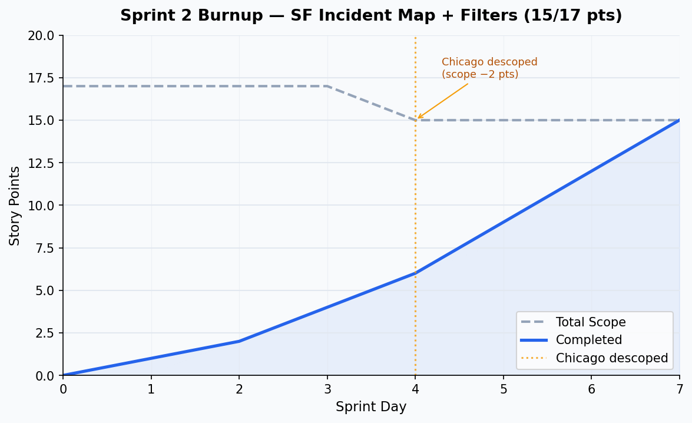

# Sprint 2 Report
**Product:** LENS
**Team:** LENS
**Date:** July 2026

---

## Actions to Stop

- **Stop creating cards on the scrumboard that silently block teammates.** Frontend cards were added to the sprint without marking their backend dependencies as blockers. This meant a teammate could pick up a card, get stuck immediately, and have no clear path to unblock — wasting sprint time. Cards that depend on another card's output should explicitly list what they're waiting on before the sprint starts.

---

## Actions to Start

- Start writing explicit Acceptance Criteria and Definition of Done for each card before work begins, not after.
- Start sharing the database dump so teammates with backend dependencies are not blocked.
- Start holding brief check-ins when a card is blocked rather than letting it stall silently.

---

## Actions to Keep

- Writing spike findings to `docs/spikes/` — it produced a defensible, documented methodology that can be cited in the final report.
- PR-based code review even on solo contributions — keeps history clean and lets teammates see what changed.
- Logging dropped data explicitly rather than silently cleaning it (enforced in `ingest.py`).

---

## Work Completed

| Card | Owner | Pts | Acceptance Criteria | Definition of Done |
|---|---|---|---|---|
| SF crime data pull script + MoSCoW documentation | Jacob | 1 | Script pulls real DataSF data; coverage documented | Script runs; docs committed ✅ |
| Unified incident model + Alembic migration + ingest.py + Socrata client | Jacob | 3 | 1M+ rows load in under a minute; schema matches target | `raw_reports` = 1,042,932; `incidents` = 745,746 ✅ |
| SF map with PostGIS + Leaflet (G1) | Jacob | 5 | Real SF incidents appear on map for any date range | Open map, pick dates, see real dots ✅ |
| Placeholder website | Jacob | 1 | App renders in browser | Page loads ✅ |
| Backend tests | Jacob | 2 | 9 transform tests + 5 API tests pass in CI | CI green ✅ |
| Crime type + date filters (G2) | Jacob | 3 | Filtering by category and date range returns correct subset | Burglary + March 2025 → 277 rows, all Burglary ✅ |

---

## Work Not Completed

| Card | Owner | Reason |
|---|---|---|
| Chicago data pull script | Louisa, Ishita, Jacob | Descoped — prior analysis was AI-generated and unverified. Chicago restarted from scratch in a future sprint. |

---

## Work Completion Rate

- Story points completed: **15**
- Sprint duration: ~1 week (7 days)
- Ideal hours (at 2 hrs/pt): 30
- Stories/day: **0.71**
- Ideal hours/day: **4.29**
- Cumulative avg (Sprints 1–2): 0.71 stories/day | 3.43 hrs/day

---

## Burnup Chart

