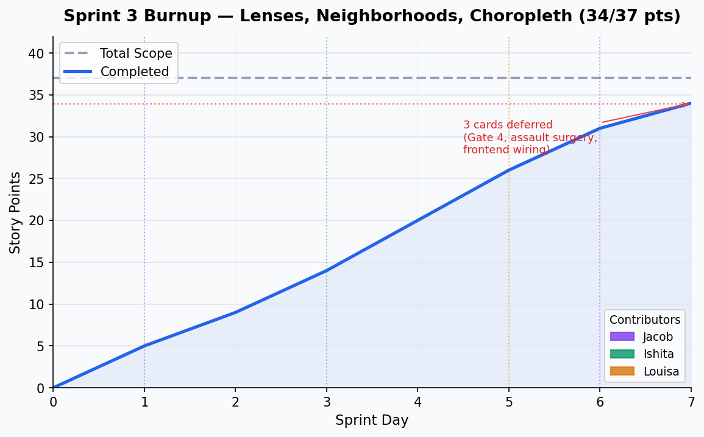

# Sprint 3 Report
**Product:** LENS
**Team:** LENS
**Date:** July 2026

---

## Actions to Stop

- **Stop each team member working in isolation without a shared database.** This caused Louisa to build the entire frontend against mock data and blocked real API wiring until Jacob manually produced and shared a DB dump. This is a structural problem that Sprint 4's deployment card must fix.
- **Stop letting shared data files live only on one person's machine.** The neighborhood GeoJSON, ACS population CSV, and census crosswalk were never committed or shared, causing hours of debugging when another teammate needed them. They should live in a shared Drive folder documented in the repo.

---

## Actions to Start

- Start agreeing on the exact JSON response shape (field names, nullable fields, types) before splitting backend/frontend work.
- Start planning a shared hosted environment (Sprint 4 deployment card) so no one has to hand-distribute DB dumps going forward.

---

## Actions to Keep

- Spike-first methodology before building anything. G1/G2/G3 validation gates prevented building lens logic on wrong assumptions about category behavior and resolution windows.
- Writing teammate briefs in `docs/team_briefs/` — Ishita and Louisa could work independently without needing sync meetings.

---

## Work Completed

| Card | Owner | Pts | Acceptance Criteria | Definition of Done |
|---|---|---|---|---|
| Spike: Aggregation unit | Jacob | 1 | Decision documented with rationale | `docs/spikes/aggregation_unit.md` + ADR committed ✅ |
| Spike: Per-capita denominator | Jacob | 3 | Know what population number to use and how defensible it is | `docs/spikes/per_capita_denominator.md`; ACS B01003 + crosswalk confirmed ✅ |
| Spike: G2 — per-category resolution window | Jacob | 1 | Per-category N value determined | MVT 30d, Assault 150d, Burglary 180d, Robbery 190d ✅ |
| Spike: G3 — resolution trend decomposition | Jacob | 1 | Understand resolution rate rise since Aug 2024 | +9.1pp: 62% composition shift, 38% within-category ✅ |
| Data engineering methodology docs | Jacob | 3 | Methodology defensible in writing | `docs/methodology.md`, `docs/adr/001` committed ✅ |
| API contract design | Jacob | 1 | Frontend and backend agree on request/response shape | Contract documented, shared with Louisa ✅ |
| Geography dimension table | Ishita | 3 | 41 neighborhoods loaded with correct polygons and population | `SELECT COUNT(*) FROM neighborhoods` = 41 ✅ |
| Precomputed aggregate tables | Ishita | 3 | `neighborhood_month_rollup` table created with correct schema | Migration runs clean; table exists with correct columns ✅ |
| Batch aggregation job | Ishita | 5 | Rollup matches direct COUNT on incidents | 78,470 rollup rows; spot-checks match ✅ |
| GET /neighborhoods | Jacob | 2 | Returns 41 neighborhoods as GeoJSON FeatureCollection with all properties | 3 tests pass; all 5 properties present on every feature ✅ |
| GET /lens/1, /lens/2, /lens/3 | Jacob | 3 | Lens endpoints return correct schema; Lens 3 returns 503 | Tests pass: date validation, schema check, null suppression for parks ✅ |
| Migrate frontend to Next.js | Louisa | 2 | App runs under Next.js; Leaflet works client-side | `frontend-next/` boots; Leaflet renders via `dynamic()` with `ssr: false` ✅ |
| Choropleth layer | Louisa | 5 | Map colors neighborhoods by lens value from real API | Choropleth renders from `/neighborhoods` + `/lens/1`; ID join works ✅ |
| Lens toggle | Louisa | 2 | Switching lens re-fetches data and recolors the map | Toggle changes `activeLens`, triggers refetch ✅ |
| Neighborhood sidebar | Louisa | 3 | Clicking a neighborhood opens a panel with metrics | Panel opens on click, shows lens values and flags ✅ |

---

## Work Not Completed

| Card | Owner | Reason |
|---|---|---|
| Gate 4: CA DOJ external validation | Jacob | Deferred — blocks Lens 3 from being called "externally validated" but does not block Sprint 3 delivery. Moved to Sprint 4. |
| Assault surgery (split Aggravated/Simple Assault) | Jacob | Deferred — prerequisite for Lens 3. Moved to Sprint 4 stretch. |
| Frontend: category dropdown + incident dot layer reconnect | Louisa | Partially complete — lens choropleth wired to real API; dot map and `/categories` fetch not yet reconnected. |

---

## Work Completion Rate

- Story points completed: **34**
- Sprint duration: ~1 week (7 days)
- Ideal hours (at 2 hrs/pt): 68
- Stories/day: **2.14**
- Ideal hours/day: **9.71**
- Cumulative avg (Sprints 1–3): 1.19 stories/day | 5.59 hrs/day

---

## Burnup Chart

