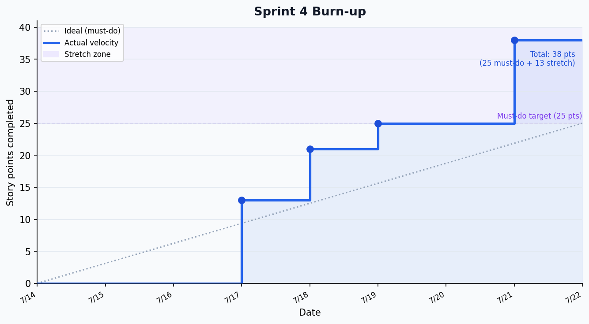

# Sprint 4 Report — LENS

**Product:** LENS
**Team:** LENS
**Date:** July 22, 2026

---

## Actions to Stop

- **Stop shipping frontend features without testing at multiple viewport sizes.** The controls bar breakpoint had to be fixed mid-sprint after buttons squeezed and the toolbar collapsed too late. Edge cases at narrow viewports should be checked before a PR is opened, not discovered in review.
- **Stop treating the cross-year date picker as an obvious constraint.** When a user drags the "After" end date into the next calendar year, the year-over-year pattern comparison breaks in a non-obvious way. These kinds of implicit constraints need to be caught during card design, not post-merge.

---

## Actions to Start

- **Start defining viewport test cases as part of every UI card's Definition of Done.** Before a PR is merged, verify the feature at 375px (iPhone SE), 768px (tablet), and 1440px (desktop). Add this to the team's working agreement.
- **Start writing system-level acceptance test walkthroughs before implementation.** The Identify Anomaly feature went through several iterations because edge cases (same-year events, right-censored years in baseline, selected neighborhood not threading through) weren't anticipated. A one-page walkthrough of the happy path and three edge cases before coding would have surfaced these.

---

## Actions to Keep

- **Keep the PR-required workflow with CI on every merge.** This caught regressions (the CI tests branch rebase removing PDF work) before they hit main.
- **Keep the spike-before-build discipline.** The proactive/reactive classifier spike, G1/G2/G3 validation gates, and Lurie enforcement shift validation all produced findings that changed implementation decisions — if those had been skipped, we'd have built on wrong assumptions.
- **Keep writing all findings to `docs/spikes/`.** The spike docs are the paper trail that makes findings citable. The G1 category validation and G3 trend decomposition findings in particular are defensible in writing because they were documented.
- **Keep Docker Compose as the shared environment.** The deployment card proved this out — anyone can run the app with one command, and the TA can verify it without setup friction.

---

## Work Completed

| Card | Owner | Pts | Status |
|---|---|---|---|
| Card 1 — Compare endpoint | Preetam | 5 | ✅ merged PR #67 Jul 17 |
| Card 2 — Compare mode UI | Louisa | 5 | ✅ merged PR #73 Jul 17 |
| Card 3 — Policy event presets | Heli | 3 | ✅ merged PR #78 Jul 18 |
| Card 4 — Neighborhood rankings | Ishita / Louisa | 3 | ✅ merged PR #74 Jul 17 |
| Card 5 — Language simplification | Jacob | 1 | ✅ merged PR #85 Jul 18 |
| Card 6 — Deployment | Heli | 3 | ✅ merged PR #81 Jul 18 |
| Card 7 — Controls bar responsive *(stretch)* | Louisa | 2 | ✅ merged PR #86 Jul 19 |
| Card 8 — Lurie spike validation *(stretch)* | Jacob | 1 | ✅ merged PR #77 Jul 18 |
| Card 11 — CI tests | Louisa | 5 | ✅ merged PR #93 Jul 21 |
| Card 12 — Mobile responsive spike *(stretch)* | Louisa | 2 | ✅ merged PR #89 Jul 19 |
| Card 13 — Generate Report / Identify Anomaly *(stretch)* | Ishita / Jacob | 8 | ✅ merged PR #94 Jul 21 |

---

## Work Not Completed

| Card | Reason |
|---|---|
| Card 9 — Bottom-left UI collision | Deprioritized; delta legend and zoom controls overlap only in compare mode on specific viewports. Moved to backlog. |
| Card 10 — World Cup spike | Deferred — Jul 2026 data still accumulating; comparison would be right-censored. |
| Stretch A — Assault surgery | Did not fit sprint; architecture is designed for it (Lens 3 endpoint returns 503 as placeholder). |
| Stretch C — G4 external validation | Blocked on Stretch A. |

---

## Work Completion Rate

- **Story points completed:** 38 (25 must-do + 13 stretch)
- **Sprint duration:** 8 days (Jul 14–Jul 22)
- **Ideal hours (at 2 hrs/pt):** 76
- **Cards completed:** 11
- **Cards/day:** 1.38
- **Story points/day:** 4.75
- **Ideal hours/day:** 9.5 (across team of 5)

**Cumulative average across all sprints:**

| Sprint | Pts | Days | Pts/day | Cards/day |
|---|---|---|---|---|
| Sprint 1 | 9 | 7 | 1.29 | 0.71 |
| Sprint 2 | 15 | 7 | 2.14 | 0.71 |
| Sprint 3 | 34 | 7 | 4.86 | 2.14 |
| Sprint 4 | 38 | 8 | 4.75 | 1.38 |
| **Cumulative avg** | **—** | **—** | **3.26** | **1.24** |

---

## Burnup Chart

38 points delivered in 8 days. Must-do target (25 pts) hit by Jul 21. Stretch cards (13 pts) pushed total to 38 — the highest single-sprint output of the project.
